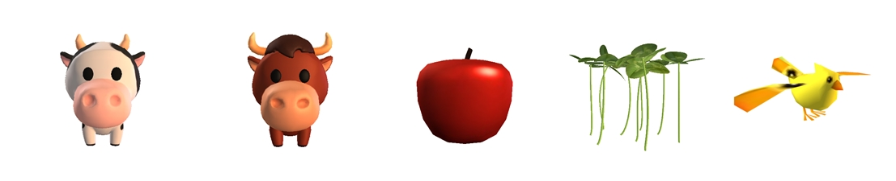
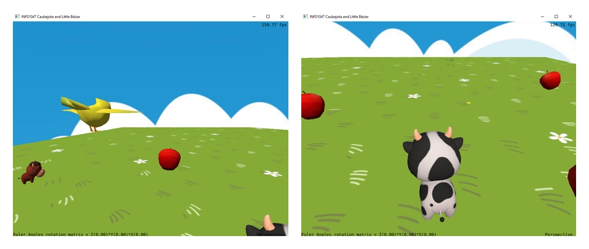
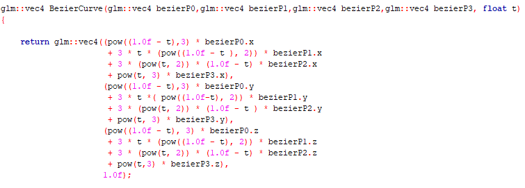
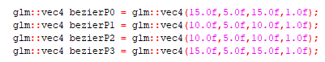
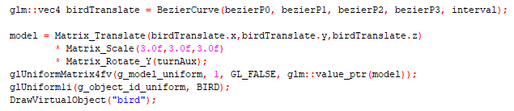

# fcgTrabalhoFinal
# **RELATÓRIO**

Trabalho final da disciplina INF01047 - Fundamentos de Computação Gráfica.                                              
Prof. Eduardo Gastal, semestre de de 2023/1 da UFRGS.                                                                   
Nome/Aluna: Milena Lopes Maciel                                                                                      
  Trabalho: Caubejota and Little Bézier: O Jogo

## Sobre o jogo:
Caubejota é uma vaquinha que precisa alimentar seu bezerrinho, Bézier, de forma adequada. Num cenário com diferentes opções de alimentação, ela deve fazer a melhor escolha para gerar o melhor alimento. Caubejota porém, durante sua jornada, deve atentar-se aos obstáculos (outros personagens) para que não perca suas vidas. Estando em um plano que flutua no céu, Caubejota também tem que cuidar para não sair fora nos limites do plano e cair. 

## Contribuições: 
Trabalho foi feito de forma individual.

## Uso do ChatGPT: 
Utilizado apenas para sanar dúvidas referente a sintaxe de código em C++, ou alguma compreensão de lógica de alguma parte do código fornecido no laboratório 5 pelo professor.

## Malhas poligonais complexas:

## Transformações geométricas:
Foram aplicadas transformações geométricas no controle de movimento da vaquinha pelo plano. 

## Câmera livre e câmera look-at:
Camêra livre foi usada para visualização dos limites do plano.
Camêra look-at foi usada para visualização da orientação da vaquinha.

## Testes de intersecção entre objetos virtuais:
Não implementado a tempo da entrega do trabalho.

## Modelos de iluminação de objetos geométricos:
Não implementado corretamente e de forma completa a tempo da entrega do trabalho.

## Instâncias de objetos:
Os objetos "Apple", assim como "GrassFood" foram instâncias utilizadas duas ou mais vezes, aplicadas ao mesmo conjunto de vértices.

## Mapeamento de texturas:
Todos os objetos apresentados, incluindo o cenário, tiveram suas cores definidas através de texturas representadas por imagens.

## Curvas de Bézier:
Curva de Bézier cúbica foi aplicada para a movimentação do passarinho. 

## Animações baseadas no tempo:
Todos os objetos do jogo tem suas animações baseadas no tempo: movimentação das câmeras, da vaquinha, do bezerrinho, das comidas e do passarinho.

## Manual de utilização da aplicação:
ESC: Fecha o jogo.

UP/CIMA: Vaquinha vai para frente.

DOWN/BAIXO: Vaquinha vai para trás.

RIGHT/DIREITA:Vaquinha vai para direita.

LEFT/ESQUERDA: Vaquinha vai para esquerda.

MOUSE LEFT BOTTOM: Movimentação da camera livre.

## Compilação e Execução:
Windows Para compilar e executar este projeto no Windows, utilize a IDE Code::Blocks, os "Build targets" padrões (Debug e Release) estão confogirados para Code::Blocks versão 20.03 ou superior, que utiliza MinGW 64-bits. Se você estiver utilizando versões mais antigas do Code::Blocks (17.12 ou anteriores) você precisa alterar o "Build target" para "Debug (CBlocks 17.12 32-bit)" ou "Release (CBlocks 17.12 32-bit)" antes de compilar o projeto.

